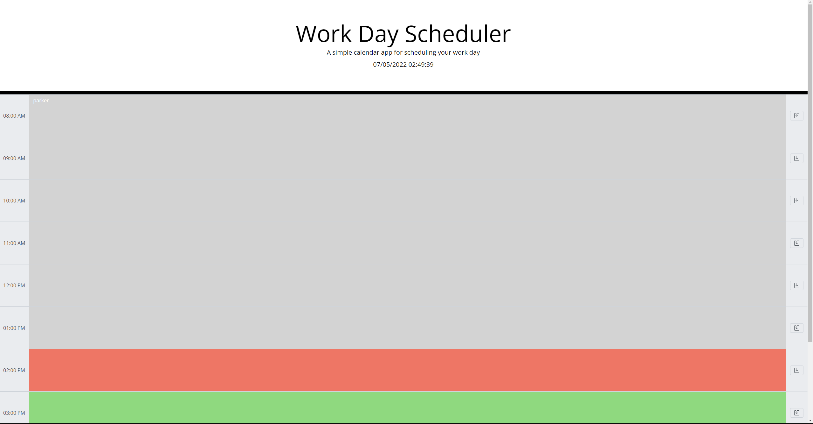

# Work Day Scheduler Starter Code
## Description

I built this project as an excercise in jquery and object manipulation. I learned a bit too late that I should not have used strings of integers as object keys. As such I ended up pulling those objects out to arrays before making any changes to the data.

My goal in this project was to code it efficiently. I only have one function that saves all text area content, clears all text areas, and redisplays them. This saved me the hassle of using multiple save/delete text/display functions. However, the front end buttons are seperate to provide the user with an illusion of choice.

I also had to dig further with jquery selectors than I expected, hence selectors such as "parseInt(sel[i - 8].attributes[1].nodeValue",, and "$(`[data-time = ${i}]`))".

## Usage

Provide instructions and examples for use. Include screenshots as needed.

To add a screenshot, create an `assets/images` folder in your repository and upload your screenshot to it. Then, using the relative filepath, add it to your README using the following syntax:

    Deployed Application: http://pem2k.github.io/calendar

    ```md
    
    ```

## Credits

Parker McKillop
github.com/pem2k
